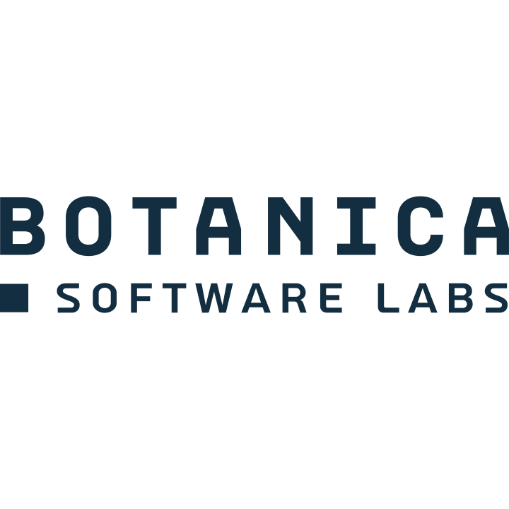

<div align="center">

<a href="https://botanica.consulting"><picture><source media="(prefers-color-scheme: dark)" srcset="docs/assets/botanica-software-labs-light.png"></picture></a>


# sod

**SSH native keys, sealed in the Secure Enclave. Use Touch ID to login.**

[](https://github.com/botanica-consulting/sod/actions/workflows/ci.yml)
[](LICENSE)
[](#requirements)
[](Package.swift) 

</div>

**sod** keeps an SSH authentication key **inside the Secure Enclave** — the private key
is generated there and never leaves it — and serves it to stock OpenSSH over the
ssh-agent protocol. **Touch ID gates every signature.** The key is a plain
`ecdsa-sha2-nistp256`, accepted by any SSH server; no FIDO/`sk-`
support required on the other end.

<div align="center">


</div>

**sod** has the same usage as the bog-standard OpenSSH tooling - just prefix with `sd` and the rest takes care of itself.

| Command | Like | Does |
|---|---|---|
| `sd ssh-keygen` | `ssh-keygen` | create a Secure-Enclave P-256 key (an opaque handle + a standard `.pub`) |
| `sd ssh-agent` | `ssh-agent` | run the agent on a unix socket; print `SSH_AUTH_SOCK` to use it |
| `sd ssh-add` | `ssh-add` | load / unload / list keys in the agent — no PIN prompt |

Plus **`sd install`** — the one-step login setup: it runs the agent at every login and
prints the single line to add to your shell startup file (`sd uninstall` reverses it).

And **`sd doctor`** — a read-only health check of your whole setup (Secure Enclave, the
default key, the login agent, the live socket, and your shell wiring) that tells you
exactly what to fix.

## Why sod

- **Non-exportable.** The handle file is an opaque, device-bound blob with no usable
  secret. Only this Mac's Secure Enclave can use the key, and only through the agent.
- **Presence on every signature.** Touch ID with
  passcode fallback, durable across fingerprint re-enrollment.
- **Stock OpenSSH.** Speaks the ssh-agent protocol; no patched `ssh`, no kernel
  extensions, no daemons running as root.
- **Zero conf.** Runs as an independent ssh agent, does not meddle with your other SSH key flows.
- **Lean.** A single notarized or self-built binary, dependant **purely** on Apple code - _zero third-party dependencies_.

## Requirements

- A Mac with a Secure Enclave (Apple Silicon, or Intel with a T2 chip) and Touch ID, macOS 13+.
- OpenSSH (`ssh`, `ssh-add`) — macOS ships it.
- To build from source: a Swift 6 toolchain (Command Line Tools is enough — no Xcode app required).

## Install

Two ways to get the `sd` binary — pick whichever suits you. **Either way, the one-time
setup afterward is the same: `sd install` (see [Quickstart](#quickstart)).**

### Homebrew

```sh
brew install botanica-consulting/tap/sod
```

Builds from source, so it needs a Swift toolchain — the Xcode **Command Line Tools**
(`xcode-select --install`), *not* the full Xcode app.

### Prebuilt installer — no toolchain

Download `sod-<version>.pkg` from [Releases](https://github.com/botanica-consulting/sod/releases)
and open it. It's a **notarized, universal binary**: no Homebrew, no compiler, nothing to
build. It copies `sd` to `/usr/local/bin` (plus its man page) and **nothing else** — it does
not touch your shell startup files or any agent. You still run `sd install` once afterward.

### From source

```sh
git clone https://github.com/botanica-consulting/sod && cd sod
make install      # builds a universal binary, installs to /usr/local (sudo)
# or just: swift build -c release   (binary at .build/release/sd)
```

## Quickstart

These steps are the same no matter how you installed `sd` — Homebrew and the `.pkg` both
land you here, and **`sd install` is the shared setup step.**

```sh
sd install             # offers to create ~/.ssh/id_sod, runs the login agent, prints your shell line
sd doctor              # verify it's all wired up (key, agent, login item, shell)
```

`sd install` does the whole setup: it offers to create `~/.ssh/id_sod` if you don't have one,
then installs a per-user LaunchAgent that runs at every login on the fixed socket
`~/.ssh/sod-agent.sock`. The agent **serves `~/.ssh/id_sod` automatically** — no `sd ssh-add`
needed; it shows up in `sd ssh-add -L` and you can drop it with `sd ssh-add -d`/`-D`. Finally,
`sd install` **prints** an `echo … >> <rcfile>` command plus `exec $SHELL` to point your shell
at the agent — it never edits your startup file for you; you run the printed `echo`. After that,
`ssh` uses sod with Touch ID on every connection. (`sd uninstall` reverses it.)

Authorize the key on your server first:

```sh
ssh-copy-id -i ~/.ssh/id_sod.pub user@host
ssh user@host          # Touch ID on connect
```

## Advanced usage

**Generate a key.** The default `~/.ssh/id_sod` never collides with your normal
`id_ecdsa`/`id_ed25519`. Or put it anywhere:

```sh
sd ssh-keygen                              # -> ~/.ssh/id_sod (+ id_sod.pub)
sd ssh-keygen -f ~/keys/work -C "me@work"  # -> ~/keys/work  (+ work.pub)
sd ssh-keygen -y -f ~/keys/work            # reprint the .pub line from a handle
```

**Run the agent.** `sd install` is the recommended path: it installs a per-user
LaunchAgent that keeps the agent on the fixed socket `~/.ssh/sod-agent.sock` across
logins (serving `~/.ssh/id_sod` automatically), then prints the commands to point your
shell at it. `sd uninstall` reverses it.

```sh
sd install                    # agent at login + the SSH_AUTH_SOCK line for your shell
sd uninstall                  # remove the LaunchAgent
```

Prefer a throwaway agent in the current shell instead (no LaunchAgent)? Use the faithful
`ssh-agent` form:

```sh
eval "$(sd ssh-agent)"        # sh/zsh/bash/csh/fish auto-detected (-s / -c to force)
sd ssh-agent -k               # stop it
```

**Point `ssh` at the agent.** `SSH_AUTH_SOCK` names a *single* agent, so you choose
whether sod is your only agent or coexists with another (1Password, Secretive, …):

*Use sod everywhere* — add the line `sd install` printed to your shell startup file:

| shell | file | line |
|---|---|---|
| zsh | `~/.zshrc` | `export SSH_AUTH_SOCK="$HOME/.ssh/sod-agent.sock"` |
| bash | `~/.bash_profile` | `export SSH_AUTH_SOCK="$HOME/.ssh/sod-agent.sock"` |
| fish | `~/.config/fish/config.fish` | `set -gx SSH_AUTH_SOCK "$HOME/.ssh/sod-agent.sock"` |

*Use sod for some hosts only* — leave `SSH_AUTH_SOCK` alone and route per-host in
`~/.ssh/config`, so your other agent keeps serving everything else:

```
Host git.example.com
    IdentityAgent ~/.ssh/sod-agent.sock

Host prod
    HostName prod.example.com
    IdentityAgent ~/.ssh/sod-agent.sock
    IdentityFile  ~/.ssh/id_sod.pub      # pin this key…
    IdentitiesOnly yes                   # …and offer only it
```

**Load / list / unload keys** (the agent already serves `~/.ssh/id_sod`; these manage
*extra* keys or drop the default — no PIN prompt, unlike stock `ssh-add -s`):

```sh
sd ssh-add ~/keys/work        # load an additional handle
sd ssh-add -l                 # list fingerprints   (-L for full public keys)
sd ssh-add -d ~/keys/work     # unload one          (-D to unload all, incl. id_sod)
```

**Authorize and connect.** Put the `.pub` on the server, then connect:

```sh
ssh-copy-id -i ~/.ssh/id_sod.pub user@host
ssh user@host                  # Touch ID on connect
```

**Interop with stock tooling.** `sd ssh-add` is just a convenience client;
the agent also speaks to stock `ssh-add`, which loads Secure-Enclave handles via its
smartcard messages:

```sh
ssh-add -s ~/.ssh/id_sod       # press Enter at the PKCS#11 PIN prompt — the SE ignores it
ssh-add -e ~/.ssh/id_sod       # unload      (ssh-add -l / -L to list)
```

**Agent forwarding is refused by default.** Forwarding a presence-gated key to a remote host
is a classic ssh-agent footgun: a compromised remote can ask your agent to sign. So when a
connection is being **forwarded** (`ssh -A` / `ForwardAgent yes`), sod presents an *empty*
agent and refuses to sign — a remote can neither use nor enumerate your Secure-Enclave key.
This is detected from the standard `session-bind@openssh.com` flag (OpenSSH ≥ 8.9), so it
distinguishes forwarding precisely:

- **`ssh -A host`** — the forwarded agent is inert (logging in to `host` itself still works).
- **`ssh -J jump host`** (`ProxyJump`) and direct connections — **unaffected**; they
  authenticate locally, not over a forwarded agent. Prefer `-J` over `-A`.

Need forwarding anyway? Run the agent with the opt-in flag:

```sh
sd ssh-agent --allow-agent-forwarding      # throwaway agent that permits ssh -A
```

## How it works

```
sd ssh-keygen ──► Secure Enclave generates a P-256 key
                   └─► ~/.ssh/id_sod      (opaque handle, no usable secret)
                       ~/.ssh/id_sod.pub  (ecdsa-sha2-nistp256 ...)

ssh ──unix socket──► sd ssh-agent ──► Secure Enclave signs  ──► Touch ID
   (ssh-agent proto)  (holds handles)    (private key never leaves the SE)
```

The agent reconstructs the public key and lists identities without prompting; only a
**signature** triggers Touch ID. Deleting the handle file orphans the key — there is
no keychain item to clean up, because the blob is the only reference to it.

## Security model

- The private key is generated in and never leaves the Secure Enclave. The handle is
  the CryptoKit `dataRepresentation` — a device-bound, SEP-wrapped blob with no usable
  secret; only this Mac's SE can use it.
- `.userPresence` = Touch ID with passcode fallback, durable across re-enrollment.
- Listing identities / reading the public key never prompts; only signing does.
- **Agent forwarding (`ssh -A`) is refused by default** — a forwarded connection sees an empty
  agent and gets no signatures, so a remote host can't use the key. `ProxyJump` (`-J`) and
  direct connections are unaffected. Opt in with `sd ssh-agent --allow-agent-forwarding`.
- No keychain item, no keychain access group, no entitlements — which is also why a
  plain Developer-ID signature notarizes cleanly. See [`SECURITY.md`](SECURITY.md) to
  report a vulnerability.

## Development & testing (no Touch ID)

All SE operations sit behind a `KeyBackend` seam. A build-time mock (a plain in-process
P-256 key — real signatures, no SE, no Touch ID) runs the whole flow without a finger:

```sh
SE_SSH_MOCK=1 swift run sod-tests              # wire + keystore + agent unit suites
SE_SSH_MOCK=1 bash scripts/selftest.sh /tmp/k  # full generate → agent → ssh-add → ssh, no taps
```

The mock is compiled **only** when `SE_SSH_MOCK` is set, so it is physically absent
from any release build (which prints a loud warning if you somehow build one). See
[`CONTRIBUTING.md`](CONTRIBUTING.md) for the lint and coverage commands.

## Project layout

- `Sources/SSHWire/` — pure SSH wire format (uint32/string/mpint, ecdsa blobs,
  ssh-agent framing). No SE imports; fully unit-tested.
- `Sources/SEKeyStore/` — `KeyBackend`, `SecureEnclaveBackend`, gated `MockP256Backend`,
  the handle-file format, and provider resolution.
- `Sources/SodKit/` — the keygen/agent/add command logic + argument parsing.
- `Sources/sod/` — the thin `@main` entry point.
- `Tests/SodTests/`, `scripts/`, `packaging/`, `man/`, `docs/` — tests, build &
  packaging, the man page, and design notes (`docs/PLAN.md`, `docs/M0-RESULT.md`).

## License

[MIT](LICENSE) © Botanica Software Labs. A Botanica Software Labs product.

_**sod** is provided free of charge and as-is — no warranty, and no liability on our part. See the [MIT License](LICENSE) for the full terms._

<a href="https://botanica.consulting"></a>
